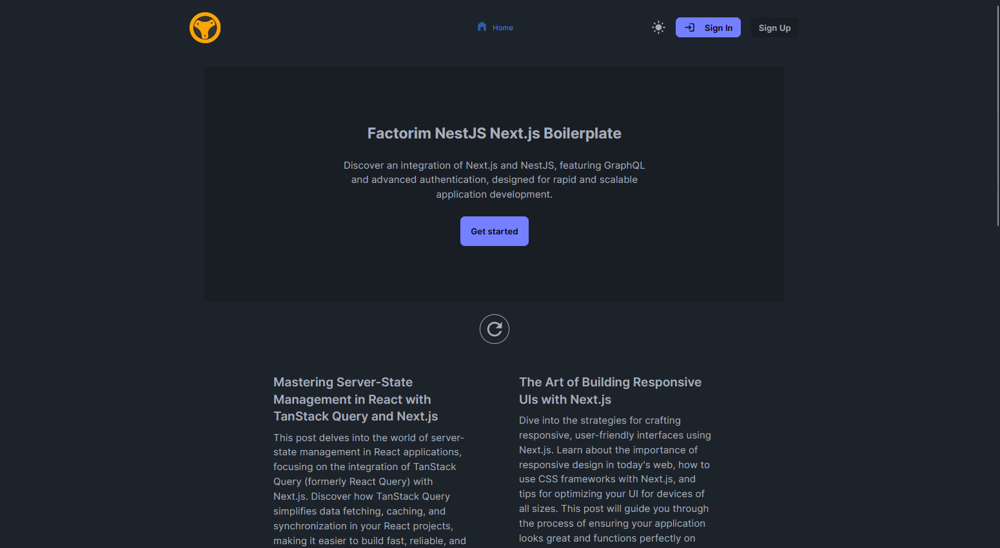
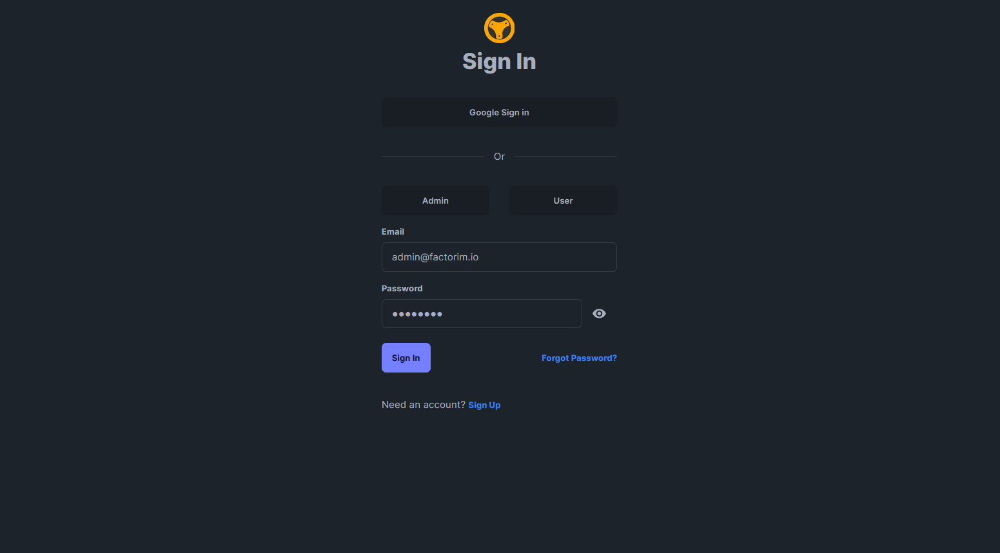
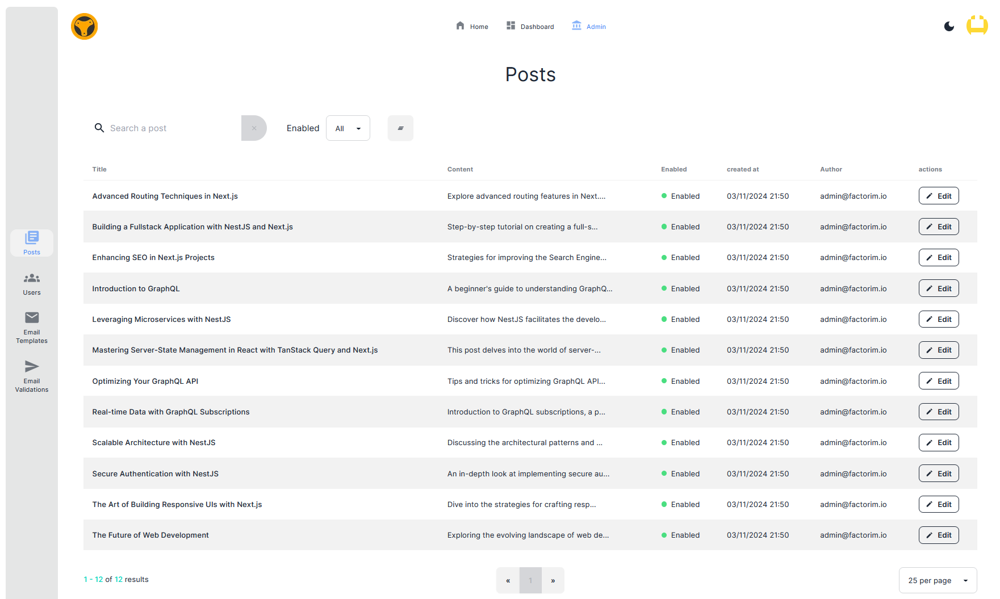

# Factorim NestJS Next.js Boilerplate

This project combines NestJS and Next.js to create a full-stack application. It includes GraphQL for API development and supports user management and posts functionality.

## Demo

The best way to get started is to dive straight into a demo.

<p align="center">
  
  
  
</p>

### Quickstart

Demo can easily be started with Docker:

```bash
make demo
```

or

```bash
docker network create factorim-network
docker composer up
```

Once started, you can go to http://localhost:3000 and click `Sign In`.

### Additional features

#### Change configuration

To change **quickstart** configuration, edit environment files in `./config`

- API config: [./config/.env.api](./config/.env.api)
- APP config: [./config/.env.app](./config/.env.app)
- Composer config: [./config/.env.composer](./config/.env.composer)

For detailed configuration explanations, please refer to the README files of each package and service (see **How to Start for Development**).

#### Enable OAuth with Google

Google OAuth needs to be configured to allow Google sign in.

1. Go to https://console.cloud.google.com/apis/credentials set credentials and get client Id and secret.
2. Replace `AUTH_GOOGLE_CLIENT_ID` and `AUTH_GOOGLE_CLIENT_SECRET`, in [./config/.env.app](./config/.env.app).

#### Enable email notification with Sendgrid

Email notifications are sent with Sendgrid.

1. Go to https://app.sendgrid.com/settings/api_keys to create an API Key.
2. Replace `EMAIL_SENDGRID_API_KEY`, `EMAIL_CONTACT` and `EMAIL_NO_REPLY`, in [./config/.env.api](./config/.env.api).

#### Enable post generation with OpenAI

Composer uses OpenAI to generate posts.

1. Go to https://platform.openai.com/api-keys to create an API Key.
2. Replace `OPENAI_API_KEY` in [./config/.env.composer](./config/.env.composer).

On setup, go to http://localhost:4001 to generate a post.

\*\*Warning\*\*: it will consume few OpenAI credits everytime you generate a post.

## Project Structure

### Packages

The project is divided into three packages:

1. **API**: This package contains the GraphQL API built with NestJS. It handles the server-side logic and data management.

2. **App**: This package contains the user interface application built with Next.js. It handles the client-side rendering and user interactions. Additionally, it integrates Storybook for developing and testing UI components in isolation.

3. **Composer**: This package is optional and contains the OpenAI Composer integration. It is responsible for generating random posts.

### Services

The project has one service:

1. **PostgreSQL**: The project relies on a PostgreSQL service for the database.

## How to Start for Development

Each package and service has its own README file with detailed instructions on how to run and develop it:

- [App README](./packages/app/README.md)
- [API README](./packages/api/README.md)
- [Composer README](./packages/composer/README.md)
- [Postgres README](./services/postgres/README.md)

## How to Deploy with Kubernetes

For deployment with Kubernetes, refer to the [Factorim Boilerplate Kubernetes Deployment Guide](./devops/kubernetes-deployment.md).

## Features

The project includes the following features:

- GraphQL API with [Prisma](https://www.prisma.io/) for data management.
- OAuth authentication with [NextAuth](https://next-auth.js.org/.
- Translation support with [react-i18next](https://github.com/i18next/react-i18next).
- [Storybook](https://storybook.js.org/) for developing and testing components.
- Email template edition with [React Email Editor](https://github.com/unlayer/react-email-editor).
- Next.js runtime env with [next-runtime-env](https://github.com/expatfile/next-runtime-env)

## Next steps

This project is a work in progress, and debugging is still ongoing. Your feedback is greatly welcomed and appreciated! If you have suggestions, questions, or need further assistance, please use **[GitHub issues](./issues)** or contact us directly on **[Discord](https://discord.gg/Tv3KVHfQMf)**.
